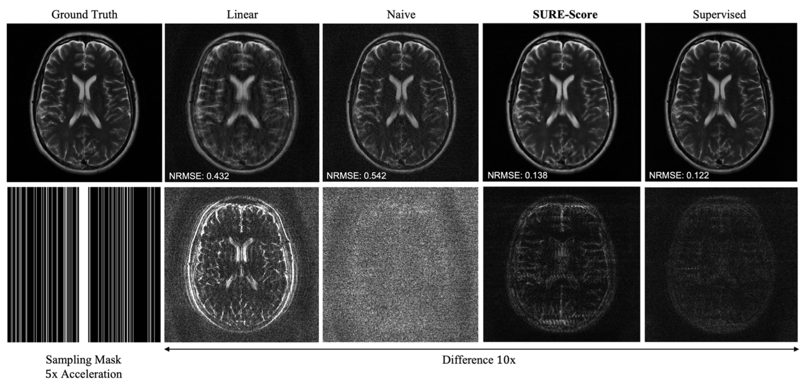

# SureScore-Diffusion
by [Asad Aali](https://asadaali.com/) and [Jon Tamir](http://users.ece.utexas.edu/~jtamir/csilab.html), UT CSI Lab.

Source code for paper [Solving Inverse Problems with Score-Based Generative Priors learned from Noisy Data](https://doi.org/10.1109/IEEECONF59524.2023.10477042), published in IEEE Asilomar Conference on Signals, Systems &amp; Computers.



(**From left to right**: Different reconstruction methods for accelerated FastMRI)

# Training
We streamline the method proposed in [Generative Modeling by Estimating Gradients of the Data Distribution](https://arxiv.org/abs/1907.05600). Score-based generative models are flexible neural networks trained to capture the score function of an underlying data distribution—a vector field pointing to directions where the data density increases most rapidly. We present a generic pipeline for training score-based generative models.

## Running Experiments

### Dependencies

Run the following to install all necessary python packages for our code.

```bash
pip install -r requirements.txt
```

### Configuration file structure

`train.py` is the file that you should run for training:

```
Usage:
python score-diffusion-training/train.py --config_path [CONFIG FILE PATH]

Configuration files are kept in `configs/`. Configuration files are structured as:

```bash
├── model # model configurations
│   └── <loss>: specify the loss function to be used for training from losses.py
│   └── <depth>: choose from "low", "medium", "large" to specify NCSNV2 model size, large -> deepest NCSNV2 model
│   └── <gpu>: specify GPU id to run the training on
│   └── <ngf>: number of hidden layers in the model. large values increase model complexity. should range between 32 - 128 based on complexity
│   └── <num_classes>: determines number of sigmas/noise levels to train the model on. a value between 2000-3000 helps train the model on various levels
│   └── <sigma_rate>: controls geometric progression of sigmal levels. if SURE training, can specify function "sigma_rate_sure" for automated calculation
│   └── <get_sigmas>: use "get_sigmas_sure" if SURE training. leave empty otherwise for automated calculation
│   └── <sigma_end>: provide a sigma_end value to specify lowest sigma level. leave empty for automated calculation
├── data # dataloader and dataset configurations
│   └── <dataloader>: specify name of the dataloader you have developed
│   └── <file>: name of file or dataset you will be training on
│   └── <path>: path where the dataset is kept
│   └── <noise_std>: noise added during training at certain SNR for SURE training
├── training # training configurations
│   └── <batch_size>: batch size used by the dataloader
│   └── <n_epochs>: max # of times training is run on the entire dataset
│   └── <seed>: random seed generator,
│   └── <X_train>: specify the matrix from the dataloader dictionary to train on
```

** Before running training, the highest sigma_level will need to be specified in a .txt file at location `parameters/` with name `config.data.file`.

Models will be saved in `models/`.

# Sampling

## Running Experiments

### Dependencies

Run the following to install all necessary python packages for our code.

```bash
pip install -r requirements.txt
```

### Configuration file structure

`ald.py` contains code for running the score-based generative model sampling algorithm. However, we use `sampling.py` to prepare the dataset and confgurations for samplin. `sampling.py` is the file that you should run for sampling:

```
Usage:
python score-diffusion-training/sampling.py --config_path [CONFIG FILE PATH]

Configuration files are kept in `configs/`. Configuration files are structured as:

```bash
├── sampling # sampling configurations
│   └── <dataloader>: specify the dataloder for loaading data for posterior sampling
│   └── <forward_class">: specify the name of forward class in a utils.py file. this forward class will be used for computing forward and adjoint for annealed langevin dynamics algorithm during posterior sampling.
│   └── <sampling_file>: name of the dataset/file for storing results
│   └── <sampling_path>: path where the sampling measurements are kept
│   └── <target_model>: location of the pre-trained model for sampling
│   └── <noise_boost>: power of the additive noise during each annealed langevin dynamics step
│   └── <dc_boost>: controls scaling of the data consistency term in the langevin algorithm
│   └── <sigma_offset>: controls number of initial sigma levels to skip when sampling. skips the highest sigma levels
│   └── <prior_sampling>: specify 1 for prior sampling and 0 for posterior. note that forward class must be provided if posterior sampling
│   └── <image_size>: provide pixels for the image to be generated in the format: [1, 384, 384]
│   └── <snr_range>: specify SNR levels for the undersampled measurements to perform sampling on as a list: example -> [-20, -15, -10, -5, 0, 5]. please note that you must apply the specified noise from SNR list to your undersampled measurements in the utils.py file.
│   └── <steps_each>: specify # of steps for each noise level during the langevin algorithm
│   └── <seed>: sampling seed
```

Samples will be saved in `results/`.

## References

```bib
@article{jalal2021robust,
  title={Robust Compressed Sensing MRI with Deep Generative Priors},
  author={Jalal, Ajil and Arvinte, Marius and Daras, Giannis and Price, Eric and Dimakis, Alexandros G and Tamir, Jonathan I},
  journal={Advances in Neural Information Processing Systems},
  year={2021}
}
```

```bib
@inproceedings{song2020improved,
  author    = {Yang Song and Stefano Ermon},
  editor    = {Hugo Larochelle and
               Marc'Aurelio Ranzato and
               Raia Hadsell and
               Maria{-}Florina Balcan and
               Hsuan{-}Tien Lin},
  title     = {Improved Techniques for Training Score-Based Generative Models},
  booktitle = {Advances in Neural Information Processing Systems 33: Annual Conference
               on Neural Information Processing Systems 2020, NeurIPS 2020, December
               6-12, 2020, virtual},
  year      = {2020}
}
```

```bib
@inproceedings{song2019generative,
  title={Generative Modeling by Estimating Gradients of the Data Distribution},
  author={Song, Yang and Ermon, Stefano},
  booktitle={Advances in Neural Information Processing Systems},
  pages={11895--11907},
  year={2019}
}
```

```bib
@article{metzler2018unsupervised,
  title={Unsupervised learning with Stein's unbiased risk estimator},
  author={Metzler, Christopher A and Mousavi, Ali and Heckel, Reinhard and Baraniuk, Richard G},
  journal={arXiv preprint arXiv:1805.10531},
  year={2018}
}
```
